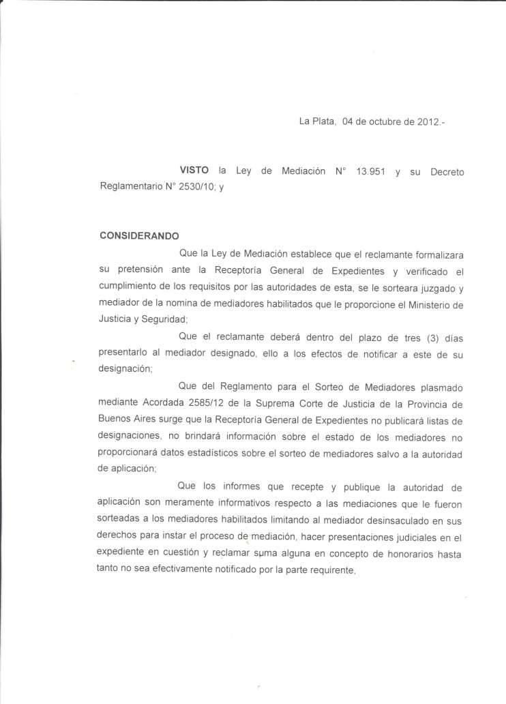
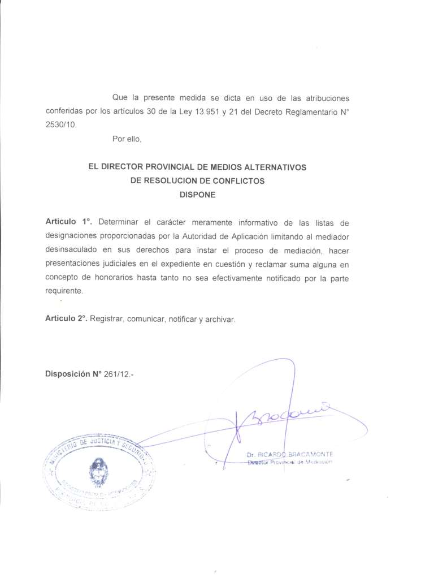

<!DOCTYPE html>

<html xmlns="http://www.w3.org/1999/xhtml" lang="" xml:lang="">
<head>
<title>26112</title>
<meta http-equiv="Content-Type" content="text/html; charset=UTF-8"/>
<meta name="generator" content="pdftohtml 0.36"/>
<meta name="author" content="webmaster"/>
<meta name="date" content="2012-10-09T12:20:12+00:00"/>

</head>
<body bgcolor="#A0A0A0" vlink="blue" link="blue">
 
&#160; 
&#160; 
&#160; 

 
&#160; 

</body>
</html>

La Plata, 04 de octubre de 2012.-

VISTO la Ley de Mediación W 13.951 y su Decreto Reglamentario W 2530/10; y

CONSIDERANDO

Que la Ley de Mediación establece que el reclamante formalizara su pretensión ante la

Receptoría General de Expedientes y verificado el cumplimiento de los requisitos por las

autoridades de esta, se le sorteara juzgado y mediador de la nomina de mediadores habilitados

que le proporcione el Ministerio de Justicia y Seguridad;

Que el reclamante deberá dentro del plazo de tres (3) días presentarlo al mediador

designado, ello a los efectos de notificar a este de su designación;

Que del Reglamento para el Sorteo de Mediadores plasmado mediante Acordada 2585/12

de la Suprema Corte de Justicia de la Provincia de Buenos Aires surge que la Receptoría General de

Expedientes no publicará listas de designaciones, no brindará información sobre el estado de los

mediadores no proporcionará datos estadísticos sobre el sorteo de mediadores salvo a la

autoridad de aplicación;

Que los informes que recepte y publique la autoridad de aplicación son meramente

informativos respecto a las mediaciones que le fueron sorteadas a los mediadores habilitados

limitando al mediador desinsaculado en sus derechos para instar el proceso de mediación, hacer

presentaciones judiciales en el expediente en cuestión y reclamar suma alguna en concepto de

honorarios hasta tanto no sea efectivamente notificado por la parte requirente,

Que la presente medida se dicta en us de las atribuciones conferidas por los artículos 30 de la Ley

13.951 y 21 del Decreto Reglamentario 2530/10.

Por ello,

EL DIRECTOR PROVINCIAL DE MEDIOS ALTERNATIVOS

DE RESOLUCION DE CONFLICTOS

DISPONE

Articulo 1. Determinar el carácter meramente informativo de las listas de designaciones

proporcionadas por la Autoridad de Aplicación limitando al mediador desinsaculado en sus

derechos para instar el proceso de mediación, hacer presentaciones judiciales en el expediente en

cuestión y reclamar suma alguna en concepto de honorarios hasta tanto no sea efectivamente

notificado por la parte requirente.

Articulo 2°. Registrar, comunicar, notificar y archivar.

Disposición Nº 261/12.-
