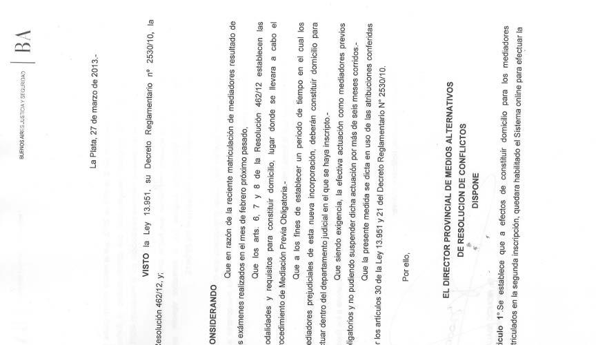
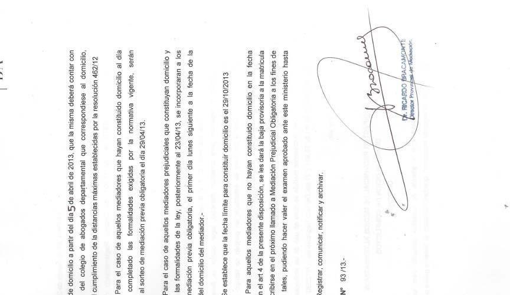
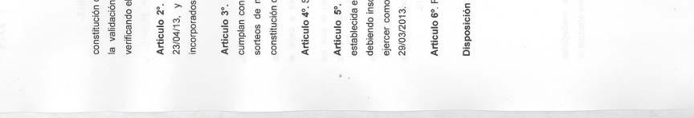

<!DOCTYPE html>
<html xmlns="http://www.w3.org/1999/xhtml" lang="" xml:lang="">
<head>
<title>Fotografía de página completa</title>
<meta http-equiv="Content-Type" content="text/html; charset=UTF-8"/>
<meta name="generator" content="pdftohtml 0.36"/>
<meta name="author" content="Publicaciones"/>
<meta name="date" content="2013-04-04T11:43:21+00:00"/>

</head>
<body bgcolor="#A0A0A0" vlink="blue" link="blue">
 
 

 
 

</body>
</html>
